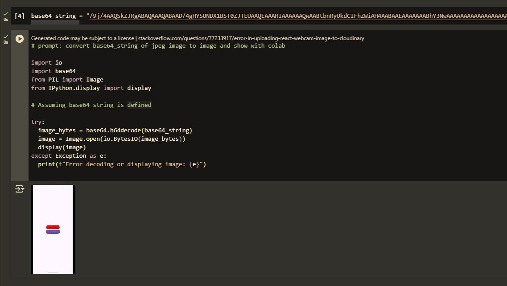

# android_screen_capture
android kotlin app to take screen shot


press takescreenshot button and copy base64 string from logcat


# FYI
- it only take screenshot every 1 sec
- and take only when screen changed


# Convert base64jpeg to image

```

import io
import base64
from PIL import Image
from IPython.display import display

# Assuming base64_string is defined

try:
  image_bytes = base64.b64decode(base64_string)
  image = Image.open(io.BytesIO(image_bytes))
  display(image)
except Exception as e:
  print(f"Error decoding or displaying image: {e}")


```


